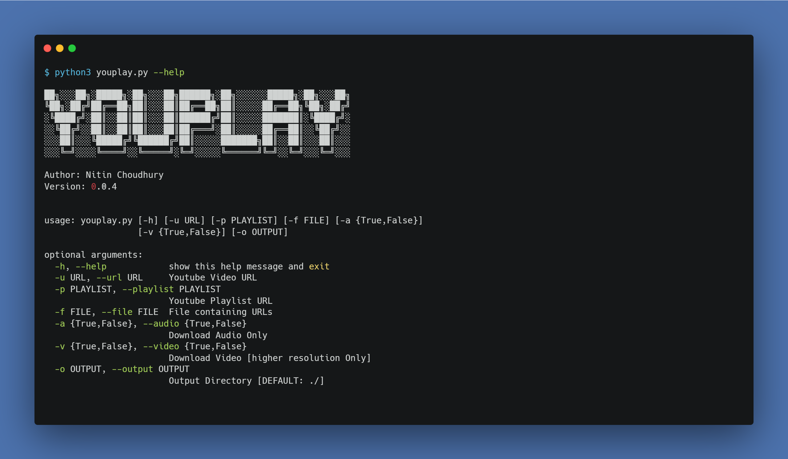

# YouPlay
YouPlay is a python based tool for downloading YouTube videos through its URL. It is capable to download videos from YouTube playlists too and can extract the audio file only from the video. It can read URLs from files and can download contents as per instruction.

## Requirements
This is a python based file. So, to run this file you will require a python environment.

## Set-Up
Step-1: Download the zip file or clone

`git clone https://github.com/nitin293/YouPlay.git`

Step-2: Install required modules

```
cd YouPlay
pip3 install -r requirements.txt
```


Step-3: Run the file

`python3 youplay.py --help`



## Uses:

> Downloading Video File

* Download from specific URL

`python3 youplay.py -u "<YouTube Video URL>"`

OR

`python3 youplay.py -u "<YouTube Video URL>" -v True`


* Download from specific URL

`python3 youplay.py -p "<YouTube Playlist URL>"`

OR

`python3 youplay.py -u "<YouTube Playlist URL>" -v True`


* Download from URLs stored in a file

`python3 youplay.py -f "<file/to/path/filename>"`

OR

`python3 youplay.py -u "<YouTube Video URL>" -v True`


> Downloading Audio File

* Download from specific URL

`python3 youplay.py -u "<YouTube Video URL>" -a True`


* Download from specific URL

`python3 youplay.py -p "<YouTube Playlist URL>" -a True`


* Download from URLs stored in a file

`python3 youplay.py -f "<file/to/path/filename>" -a True`


